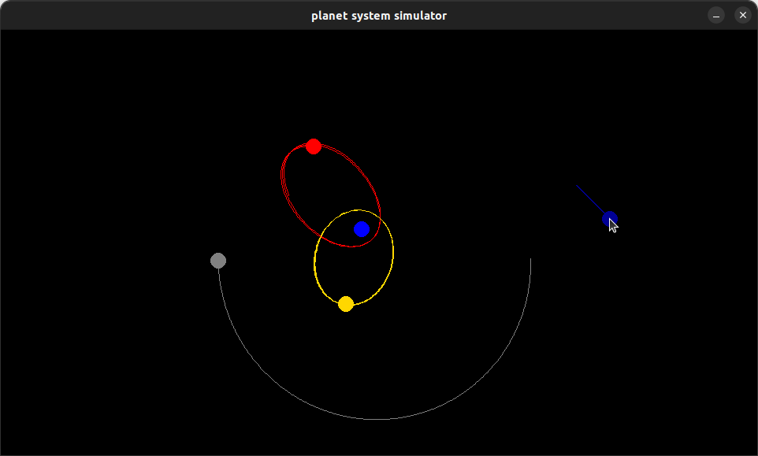

# Planet Simulation Game :earth_americas:
Another fun challenge I've given myself. I absolutely love creating physics simulations, so I'm going to attempt to make a more controllable version of my previous planet simulation game. The intention is to allow the user to make planets and see how they behave under each other's gravitational influence. I don't intend to add any collision physics, however I may decide to code some in at some later date.

## description :book:
This is a sandbox game in which a player may place any planets they wish to. The player may choose a mass, direction and speed prior to placing the planet. The player may also choose the color of the planet they play before placing it. Once a planet is placed, it will follow the laws of newtonian gravitation with every body in the simulation and behave accordingly.

## how to install :floppy_disk:
To play, you must have python installed as well as the pygame module. To install pygame, write the following command in your terminal ``pip install pygame``.

__steps to install and play the game__
1. ``git clone https://github.com/KasraRahimi/planet-system-maker.git``
2. ``cd planet-system-maker``
3. ``python run.py`` or ``python3 run.py``

## controls :keyboard:
* <kbd>w</kbd> - increase planet's speed
* <kbd>a</kbd> - increment planet's direction counter-clockwise
* <kbd>s</kbd> - decrease planet's speed
* <kbd>d</kbd> - increment planet's direction clockwise
* <kbd>q</kbd> - increase planet's mass
* <kbd>e</kbd> - decrease planet's mass
* <kbd>r</kbd> or <kbd>t</kbd> - cycle through colors

## image of the game
Here is an example of what the game looks like with some planets orbiting each other.
